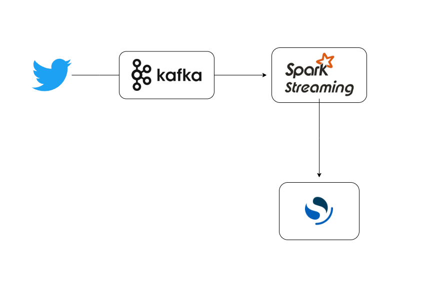

### **Project Title:**  
**Real-Time Twitter Streaming Pipeline**  

---

### **Short Description:**  
A real-time data pipeline to collect, process, and analyze tweets for sentiment analysis. It uses Kafka for data ingestion, Spark Streaming for real-time processing, and stores the results for visualization and analytics.  

---

### **About:**  
**Real-Time Twitter Sentiment Analysis - Data Engineering Pipeline:**  
This project demonstrates a scalable architecture to process real-time tweets, leveraging **Kafka** for ingestion, **Spark Streaming** for processing, and outputs data to **OpenSearch** for storage and visualization.  

---

### **Architecture Flow:**  

1. **Data Source - Twitter API:**  
   - Streams live tweets using Twitter API with keywords or hashtags.  

2. **Data Ingestion - Kafka:**  
   - Captures and stores streaming data in Kafka topics for scalability and durability.  

3. **Data Processing - Spark Streaming:**  
   - Consumes data from Kafka topics.  
   - Processes and applies sentiment analysis algorithms to classify tweets as positive, negative, or neutral.  

4. **Data Storage - OpenSearch:**  
   - Stores processed tweets with sentiment tags for indexing and querying.  

---

### **Key Technologies Used:**  
- **Twitter API:** Fetches streaming tweets.  
- **Apache Kafka:** Manages message queues for streaming data ingestion.  
- **Apache Spark Streaming:** Processes real-time data with transformations and sentiment analysis.  
- **OpenSearch:** Stores analyzed data for visualization and further analytics.  

---

